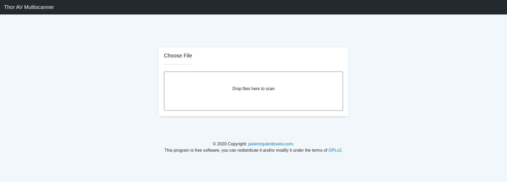
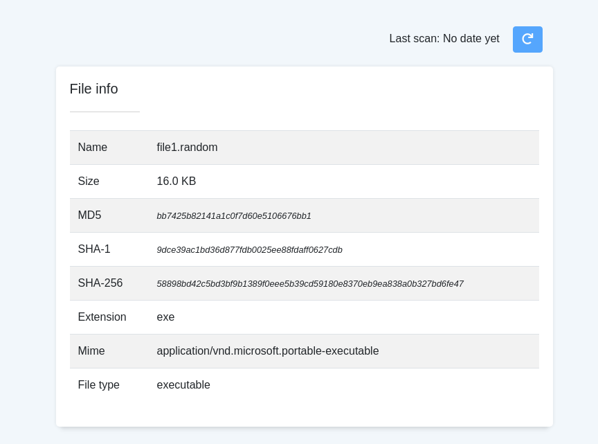
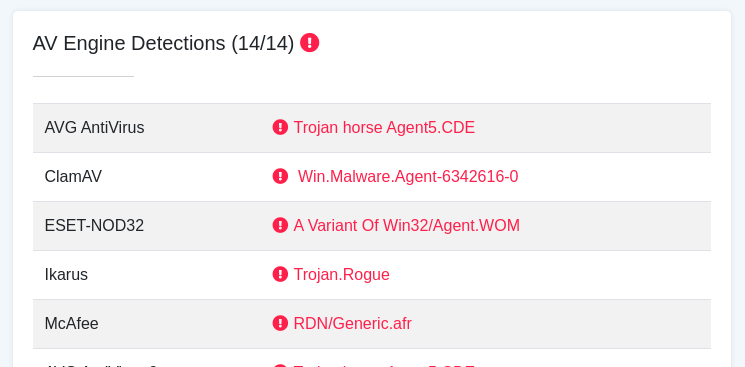

# Thor AV Multiscanner
Scan files for static analysis. This software allows you to scan a file with different antivirus engines using Dockers. Also, it allows obtaining information from a file; such as imported libraries, PE, hashes, etc.

## CLI


```
usage: thor.py [-h] [-d] [-j] [-s [FILE] | -p | -l | -u | -i [FILE]]

optional arguments:
  -h, --help            show this help message and exit
  -d, --debug           Enable debug mode
  -j, --json            Retrive response in JSON format
  -s [FILE], --scan-file [FILE]
                        Scan a specific file
  -p, --pull-dockers    Pull all the images from the configuration file
  -l, --list-avs        List of available antivirus engines
  -u, --update-avs      Update antivirus databases
  -i [FILE], --file-info [FILE]
                        Retrieve file information (File info, Portable Executable Info, Imported DLLs)

```

### Usage examples

#### Get detections using dockers

```
$ thor.py -s ../sample_files/bb7425b82141a1c0f7d60e5106676bb1

------------------------------------------------
           AV Engine Detections (6/11)          
------------------------------------------------
AVG AntiVirus: Trojan horse Agent5.CDE
Avira: HEUR/AGEN.1022518
ClamAV: Win.Malware.Agent-6342616-0
Comodo Internet Security: Malware
eScan Antivirus: Undetected
Dr. Web: Undetected
F-PROT Antivirus: Undetected
McAfee: RDN/Generic.grp
Sophos: Undetected
Windows Defender: Trojan:Win32/Aenjaris.CT!bit
ZONER AntiVirus: Undetected   
```

#### Get information from a file

```
$ python3 thor.py -i sample_files/file1.random

------------------------------
           File info          
------------------------------
Size: 16.0 KB
MD5: bb7425b82141a1c0f7d60e5106676bb1
SHA-1: 9dce39ac1bd36d877fdb0025ee88fdaff0627cdb
SHA-256: 58898bd42c5bd3bf9b1389f0eee5b39cd59180e8370eb9ea838a0b327bd6fe47
Extension: exe
Mime: application/vnd.microsoft.portable-executable
File Type: executable


--------------------------------------------------
           Portable Executable Info (PE)          
--------------------------------------------------
Target Machine: Intel 386 or later processors and compatible processors
Compilation Timestamp: 2010-12-19 11:16:19
Entry Point: 6176

SECTIONS:

 .text:
        Virtual Address: 4096
        Virtual Size: 2416
        Raw Size: 4096
        Characteristics: 1610612768
        Entropy: 4.451
        MD5: 7e39ebe7cdeda4c636d513a0fe140ff4
        SHA-1: 150d709dcae7e0ae30ac6e5c76fda74ce168a62b
        SHA-256: 44ab4d055abe09f315f217245f131fa4b9c162ffc992034b28ada7d2e8e8c87f
 .rdata:
        Virtual Address: 8192
        Virtual Size: 690
        Raw Size: 4096
        Characteristics: 1073741888
        Entropy: 1.132
        MD5: 2de0f3a50219cb3d0dc891c4fbf6f02a
        SHA-1: 9a80eabe5c64342b6bc9f4f31212ceb37b014055
        SHA-256: c6c6d685937af139911a720a86a1d901e30d015c8bc4a0d27756141e231df5eb
 .data:
        Virtual Address: 12288
        Virtual Size: 252
        Raw Size: 4096
        Characteristics: 3221225536
        Entropy: 0.439
        MD5: f5e2ba1465f131f57b0629e96bbe107e
        SHA-1: 129de8d9c6bbe1ba01c6b0d5ce5781c61eb042dc
        SHA-256: 86aa10f4f5e696b8953e0a639a9725869803d85c1642d3e86e9fc7574d2eedb3


----------------------------
           Imports          
----------------------------
 - KERNEL32.dll
 - MSVCRT.dll
 - kerne132.dll
 - C:\windows\system32\kerne132.dll
 - Lab01-01.dll
 - C:\Windows\System32\Kernel32.dll
 ```

#### Get information from a file in JSON format

```
$ python3 thor.py -i sample_files/file1.random -j

{
   "file_info":{
      "size":{
         "size":16.0,
         "unit":"KB"
      },
      "hashes":{
         "MD5":"bb7425b82141a1c0f7d60e5106676bb1",
         "SHA-1":"9dce39ac1bd36d877fdb0025ee88fdaff0627cdb",
         "SHA-256":"58898bd42c5bd3bf9b1389f0eee5b39cd59180e8370eb9ea838a0b327bd6fe47"
      },
      "magic_number":{
         "type":[
            "executable",
            "system"
         ],
         "extension":[
            "exe",
            "dll",
            "drv",
            "sys",
            "com"
         ],
         "mime":[
            "application/vnd.microsoft.portable-executable",
            "application/x-msdownload"
         ]
      }
   },
   "pe_info":{
      "sections":{
         ".text":{
            "virtual_address":4096,
            "virtual_size":2416,
            "raw_size":4096,
            "characteristics":1610612768,
            "hashes":{
               "MD5":"7e39ebe7cdeda4c636d513a0fe140ff4",
               "SHA-1":"150d709dcae7e0ae30ac6e5c76fda74ce168a62b",
               "SHA-256":"44ab4d055abe09f315f217245f131fa4b9c162ffc992034b28ada7d2e8e8c87f"
            },
            "entropy":4.451
         },
         ".rdata":{
            "virtual_address":8192,
            "virtual_size":690,
            "raw_size":4096,
            "characteristics":1073741888,
            "hashes":{
               "MD5":"2de0f3a50219cb3d0dc891c4fbf6f02a",
               "SHA-1":"9a80eabe5c64342b6bc9f4f31212ceb37b014055",
               "SHA-256":"c6c6d685937af139911a720a86a1d901e30d015c8bc4a0d27756141e231df5eb"
            },
            "entropy":1.132
         },
         ".data":{
            "virtual_address":12288,
            "virtual_size":252,
            "raw_size":4096,
            "characteristics":3221225536,
            "hashes":{
               "MD5":"f5e2ba1465f131f57b0629e96bbe107e",
               "SHA-1":"129de8d9c6bbe1ba01c6b0d5ce5781c61eb042dc",
               "SHA-256":"86aa10f4f5e696b8953e0a639a9725869803d85c1642d3e86e9fc7574d2eedb3"
            },
            "entropy":0.439
         }
      },
      "entry_point":6176,
      "target_machine":"Intel 386 or later processors and compatible processors",
      "compilation_timestamp":"2010-12-19 11:16:19"
   },
   "imports":[
      "KERNEL32.dll",
      "MSVCRT.dll",
      "kerne132.dll",
      "C:\\windows\\system32\\kerne132.dll",
      "Lab01-01.dll",
      "C:\\Windows\\System32\\Kernel32.dll"
   ]
}
```


## Web APP
The web application will allow you to perform the same operations as the CLI, but with a friendlier interface. As a difference, it has a cache that will avoid having to scan the same file several times.

Run web application:

```
$ cd app
```

```
$ python3 index.py -h
usage: index.py [-h] [-d] [-i] [-p]

optional arguments:
  -h, --help   show this help message and exit
  -d, --debug  Enable debug mode
  -i, --host   Set host on which the web application runs. Default: 127.0.0.1.
  -p, --port   Set port on which the web application runs. Default: 5000.
```

```
$ python3 index.py
```

### Screenshots







[Full page screenshot](screenshots/full_page_screenshot.png)

### Video

[](https://youtu.be/1I53Xxv1XiY)

## Configuration

At the moment, the application uses [Malice dockers images](https://hub.docker.com/u/malice "Malice dockers images"). But it can be configured to use any other image, as long as it returns the result in a similar JSON format.

This application uses a file in JSON format that indicates the Docker commands to be used for operations with each of the antivirus engines. Each object in the list represents an antivirus configured in a Docker container.

```
{
   "name":"McAfee",
   "image": "malice/mcafee"
}
```

The mandatory parameters are:

* `name`: Antivirus name.
* `image`: Docker image to be used.

Optional parameters:

* `scan_command`: Command to be used to scan a file.
* `update_command`: Command to be used to update the engine.
* `license_command`: Command to set license during a scan.
* `license`: License.

```
{
   "name":"AVG AntiVirus",
   "image": "malice/avg",
   "scan_command": "--rm -v \"{File_path}:/malware/{File_name}\" {Image} {File_name} --timeout 150",
   "update_command": "{Image} update",
   "license": "\"`pwd`/../licenses/avg/hbedv.key:/opt/avg/hbedv.key\""
}
```

The commands are parameterized, you can use the following tokens:

* `File_path`: This token will be replaced by the absolute path of the file to analyze.
* `File_name`: This token will be replaced by the name of the file to analyze.
* `License`: This token will be replaced by the license include in the configuration.

Defaults commands:

```
DEFAULT_UPDATE_COMMAND = "{Image} update"
DEFAULT_SCAN_COMMAND = "--rm -v \"{File_path}:/malware/{File_name}\" {Image} {File_name}"
DEFAULT_LICENSE_COMMAND = "-v {License}"
```

## AntiVirus

Antivirus included at the moment:

```
$ python3 thor.py -l

-------------------------------------------------------
           List of available antivirus engines          
-------------------------------------------------------
AVG AntiVirus
Avira
ClamAV
Comodo Internet Security
eScan Antivirus
Dr. Web
F-PROT Antivirus
McAfee
Sophos
Windows Defender
ZONER AntiVirus
```

View [docker_configuration.json](thor/docker_configuration.json).

## About

This project was carried out for a Master's Degree in Cyber Security at the [University of Granada](https://www.ugr.es/). Using Python 3 and Javascript, in addition to [Quart](https://pypi.org/project/Quart/), [jQuery](https://jquery.com/), and [Bootstrap](https://getbootstrap.com/). Including some external libraries like [Dropzone](https://www.dropzonejs.com/) and [fleep](https://pypi.org/project/fleep/), and borrowing [Malice](https://github.com/maliceio)'s Docker images.


## Copyright
© 2020 Copyright: [javierizquierdovera.com](https://javierizquierdovera.com/).

This program is free software, you can redistribute it and/or modify it under the terms of [GPLv2](https://www.gnu.org/licenses/old-licenses/gpl-2.0.html).
